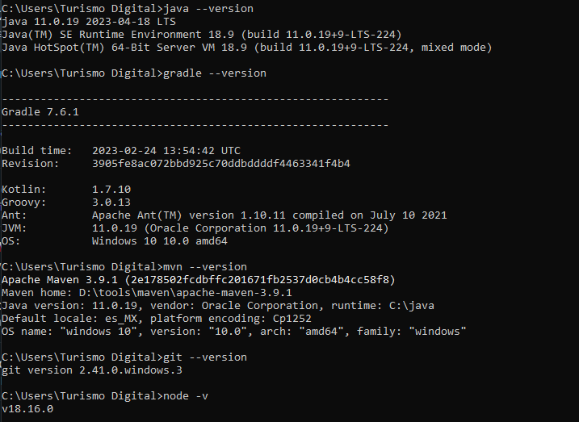

## Instruccions 

To install karate and Serenity, follow the steps below:
1 Install IntelliJ IDEA 2023.1.4 (Community Edition), or failing that VSC, https://www.jetbrains.com/es-es/idea/download/?section=windows.

2. Install Jdk jdk-11.0.2_windows-x64_bin
3. Install gradle-8.2.1 https://gradle.org/install/
4. Install Maven https://maven.apache.org/download.cgi.
5. Install Git https://git-scm.com/ (these help us to control versions).
6. Configure global variables, you must add them in Edit Environment Variables
7. Install Cucumber Plugins for Java.
8. Clone, Fork the following repository
   https://github.com/serenity-bdd/serenity-junit-screenplay-starter, this repository contains the SerenityJjunit Screenplay base
9. For the purpose of this Challenge, I attach the task https://github.com/JRafacand/nttdata
10. You can follow me at https://github.com/JRafacand
## Executing the tests
To run the sample project, you can either just run the `CucumberTestSuite` test runner class, or run either `mvn verify` or `gradle test` from the command line.

By default, the tests will run using Chrome. You can run them in Firefox by overriding the `driver` system property, e.g.
```json
$ mvn clean verify -Ddriver=chrome
```
Or
```json
$ gradle clean test -Pdriver=chrome
```

